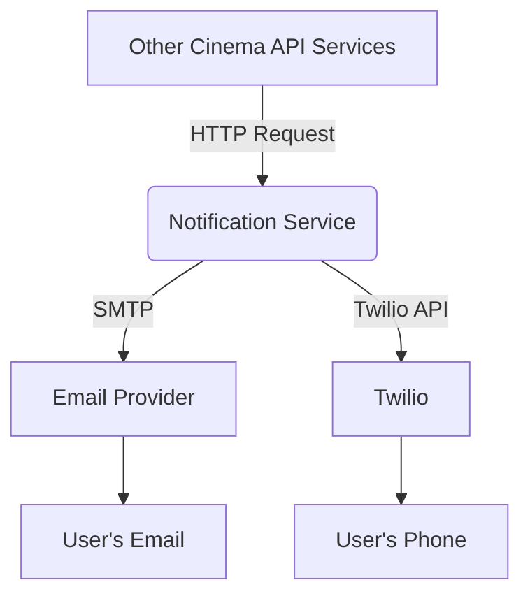

# Notification Service

This service is a component of the Cinema API ecosystem, responsible for handling all outgoing notifications to users. It provides a centralized way to send emails and SMS messages for various purposes, such as sending digital tickets, user account activation links, and other alerts.

## Architecture

The notification service is designed to be a simple, standalone microservice. It exposes a set of API endpoints that other services in the Cinema API ecosystem can call to send notifications. The service then uses third-party providers to deliver the messages.



## Features

- **Email Notifications (SMTP):**
  - Digital Tickets
  - Account Activation
  - Password Resets
  - Promotional Offers

- **SMS Notifications (Twilio):**
  - Booking Confirmations
  - Two-Factor Authentication (2FA)
  - Reminders

## Technology Stack

- **Framework:** FastAPI
- **Web Server:** Uvicorn
- **SMS Provider:** Twilio
- **Email Provider:** Any SMTP-compatible service
- **Containerization:** Docker & Docker Compose

## Configuration

Create a `.env` file in the root of the project with the following variables:

```
# SMTP Configuration
SMTP_SERVER=smtp.example.com
SMTP_PORT=587
SMTP_USERNAME=user@example.com
SMTP_PASSWORD=your_password

# Twilio Configuration
TWILIO_ACCOUNT_SID=your_account_sid
TWILIO_AUTH_TOKEN=your_auth_token
TWILIO_PHONE_NUMBER=+1234567890
```

## API Endpoints

### Health Checks

- `GET /ping`
  - **Description:** A simple ping endpoint to check if the service is alive.
  - **Response:** `{"ping": "pong!"}`

- `GET /health`
  - **Description:** A health check endpoint to verify the service is running correctly.
  - **Response:** `{"status": "ok"}`

### Notifications (Proposed)

- `POST /notifications/email`
  - **Description:** Sends an email.
  - **Request Body:**
    ```json
    {
      "to": "recipient@example.com",
      "subject": "Your Subject",
      "body": "Your email body, can be HTML."
    }
    ```

- `POST /notifications/sms`
  - **Description:** Sends an SMS message.
  - **Request Body:**
    ```json
    {
      "to": "+1234567890",
      "body": "Your SMS message."
    }
    ```

## Running the Application

### Locally

1. **Install dependencies:**
   ```bash
   pip install -r requirements.txt
   ```

2. **Run the application:**
   ```bash
   uvicorn main:app --reload
   ```

### With Docker

1. **Build the Docker image:**
   ```bash
   docker-compose build
   ```

2. **Run the service:**
   ```bash
   docker-compose up
   ```

The service will be available at `http://localhost:8005`.

