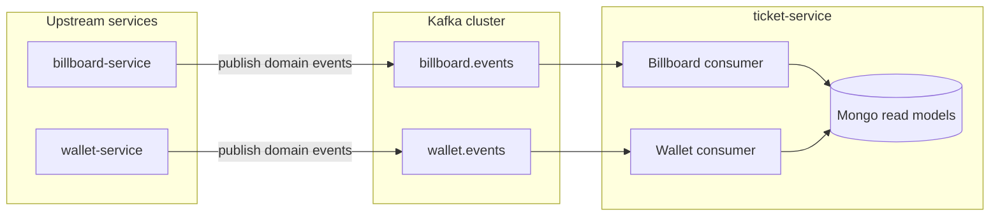

# Kafka-backed replication: billboard, wallet, and ticket-service

This document is the **architecture entry point** for keeping ticket-service’s **local Mongo read models** (duplicated billboard schemas under `app/external/billboard/`) eventually consistent with upstream services via Kafka.

**Related documents**

| Document | Content |
|----------|---------|
| [event-catalog.md](./event-catalog.md) | `event_type`, `schema_version`, payload fields for billboard and wallet |
| [kafka-topics.md](./kafka-topics.md) | Topic names, partition keys, retention, DLQ, consumer groups |
| [ticket-service-consumer-spec.md](./ticket-service-consumer-spec.md) | Mongo collection mapping, idempotency, ordering |
| [producer-roadmap.md](./producer-roadmap.md) | Phased rollout: cluster → billboard producers → backfill → consumers → wallet |

---

## 1. Context and goals

- **Why Kafka:** Ticket-service needs cinema, showtime, theater, and seat data with low latency and without overloading billboard-service HTTP APIs. A **local replica** (Mongo + duplicated entities) serves reads; **events** apply changes when the source of truth updates.
- **Wallet:** Payment events (`payment.*`) drive ticket lifecycle where applicable; payloads stay financial—no full billboard graphs inside wallet messages.
- **Consistency:** **Eventual consistency.** APIs should tolerate short lag and define product behavior when the replica is stale (e.g. cancelled showtime still referenced by an old ticket).

---

## 2. Communication diagram

**Direction of truth:** Billboard-service and wallet-service **own** their aggregates. Ticket-service **consumes only** for replication and domain reactions—it does not publish changes to those aggregates via Kafka. Commands that belong to other services may still use HTTP where appropriate.

---

## 3. Implementation status in this repo

| Area | Status |
|------|--------|
| Duplicated billboard modules + Mongo repos | Present (`app/external/billboard/`) |
| Kafka producer helper | Present ([`kafka_config.py`](../app/config/kafka_config.py), [`KafkaEventPublisher`](../app/shared/events/infrastructure/kafka_publisher.py)); legacy import [`kakfa_config.py`](../app/config/kakfa_config.py) re-exports the same helpers |
| Kafka consumers | [`kafka_config.py`](../app/config/kafka_config.py) (`KAFKA_CONSUMER_ENABLED`); [`BillboardReplicationService`](../app/external/billboard/application/services/billboard_replication_service.py) |
| Topic/consumer settings | Declared in [`app_config.py`](../app/config/app_config.py) (`KAFKA_TOPIC_*`, `KAFKA_CONSUMER_*`) |
| Billboard/Wallet consumers | Implemented in [`kafka_config.py`](../app/config/kafka_config.py); billboard sync via [`BillboardReplicationService`](../app/external/billboard/application/services/billboard_replication_service.py); wallet topic logs only until ticket domain handlers exist |

---

## 4. Quick reference: environment variables

| Variable | Purpose |
|----------|---------|
| `KAFKA_ENABLED` | Enable Kafka producer (existing ticket flows that publish) |
| `KAFKA_BOOTSTRAP_SERVERS` | Broker list |
| `KAFKA_CLIENT_ID` | Client id for producers (default: `ticket-service`) |
| `KAFKA_CONSUMER_ENABLED` | Master switch for inbound consumers (`start_kafka_consumer_tasks` in [`main.py`](../main.py)) |
| `KAFKA_TOPIC_BILLBOARD_EVENTS` | Default `billboard.events` |
| `KAFKA_WALLET_EVENTS_TOPIC` | Default `wallet.events` |
| `KAFKA_CONSUMER_GROUP_BILLBOARD` | Default `ticket-service-billboard` |
| `KAFKA_CONSUMER_GROUP_WALLET` | Default `ticket-service-wallet` |

See `app/config/app_config.py` for the full list including DLQ topic names.

---

## 5. Summary

| Layer | Role |
|-------|------|
| **Billboard / wallet services** | Own data; publish versioned events after successful writes; optional REST backfill for migration |
| **Kafka** | Durable log; topics per domain; partition keys per aggregate; DLQ for poison messages |
| **Ticket-service** | Idempotent consumers; update Mongo read models; metrics on lag and errors |

---

## 6. Next steps

1. Implement billboard event producers in **billboard-service** (not in this repo).
2. Run **Mongo backfill** in ticket-service ([producer-roadmap.md](./producer-roadmap.md)).
3. Implement **consumers** in ticket-service using the catalog and mapping docs.
4. Add **wallet** producers and ticket-service payment handlers when payment integration is ready.
